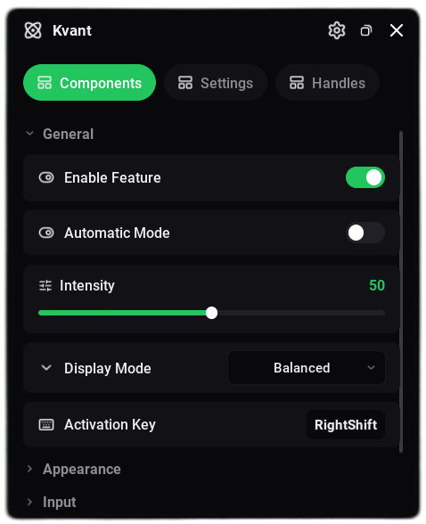

# Kvant

Minimalist UI library for Roblox. Supports both declarative (scoped) and imperative usage for fast and enjoyable scripting.
The library supports runtime theme & font switching, configuration saving. You don't need to manually set flags for configuration entries - everything works out of the box.

<br>
<p align="center">
  
</p>
<br>

## Quickstart

### Declarative Usage

Controls automatically attach to the currently open container scope.

```lua
local Kvant = loadstring(game:HttpGet("https://raw.githubusercontent.com/napHiwka/Kvant/refs/heads/main/src/init.luau"))()

local autoCollect
local speedSlider

local Window = Kvant:CreateWindow({ Name = "Project", Theme = "Darker" })

Window:Tab("Main", function()
    Section("Automation", function()
        autoCollect = Toggle("Auto Collect", false, function(state)
            print("Auto Collect:", state)
        end)
        speedSlider = Slider("Speed", 16, 100, 16)
    end)
    Section("Player", function()
        -- Don't necessarily need to assign variables to handlers if you aren't going to use them.
        Dropdown("Target", { "Head", "Torso" }, "Head")
    end)
end)

-- Manipulate controls via returned handles
autoCollect:Set(true)
print("Auto Collect state:", autoCollect:Get())
speedSlider:Set(32)
```

### Imperative Usage

Containers return objects that expose creation methods and control handles.

```lua
local Kvant = loadstring(game:HttpGet("https://raw.githubusercontent.com/napHiwka/Kvant/refs/heads/main/src/init.luau"))()

local Window = Kvant:CreateWindow("Project")
local MainTab = Window:Tab("Main")
local Automation = MainTab:Section("Automation")

local autoCollect = Automation:Toggle("Auto Collect", false)
autoCollect:Set(true)
print(autoCollect:Get())
```

---

## API Reference

### Library

#### `Kvant:CreateWindow(options)`

Creates the main window interface.

- **Parameters:**
  - `options: WindowOptions | string`
    - `Name: string?` (default: `"Kvant"`)
    - `SideTabs: boolean?` (default: `false` - top tabs)
    - `Theme: string | Theme?` (default: `"Darker"`)
    - `Size: UDim2?`
    - `MinSize: Vector2?`
    - `MaxSize: Vector2?`
    - `Icon: string?`
    - `Builder: ((window: Window) -> ())?`
- **Returns:** `Window`

#### `Kvant:SetTheme(theme)`

Applies a theme globally at runtime.

- **Parameters:**
  - `theme: string | Theme` (Built-in: `"Darker"`, `"Dark"`, `"Vesper"`, `"Light"`, `"SolorizedLight"`)

#### `Kvant:SetFont(font)`

Applies a font family globally at runtime.

- **Parameters:**
  - `font: string | Font` (Presets: `"Inter"`, `"Roboto"`, `"Ubuntu"`, or asset ID)

---

### Window

#### `Window:Tab(name, iconId?, builder?)`

Creates a tab. If `builder` is provided, sets tab context during execution.

- **Returns:** `Tab`

#### `Window:Notify(text, duration?)`

Displays a notification tile.

- **Parameters:**
  - `text: string`
  - `duration: number?` (default: `3`)

#### `Window:Destroy()`

Unbinds all connections and removes the GUI from the hierarchy.

---

### Containers (Tabs & Sections)

Methods can be called on `tab`, `section`, or as free declarative functions (`Toggle(...)`, `Slider(...)`) inside container builder scopes.

#### `Container:Section(text, collapsed?, builder?)`

Creates a collapsible category container. If empty, the header chevron remains hidden until children are added.

- **Parameters:**
  - `text: string`
  - `collapsed: boolean?` (default: `false`)
  - `builder: ((section: Section) -> ())?`
- **Returns:** `Section`
- **Handle Methods:**
  - `section:SetCollapsed(state: boolean)`

#### `Container:Toggle(text, default?, callback?, iconName?)`

- **Parameters:**
  - `text: string`
  - `default: boolean?` (default: `false`)
  - `callback: ((state: boolean) -> ())?`
- **Returns:** `ToggleHandle`
- **Handle Methods:**
  - `handle:Get() -> boolean`
  - `handle:Set(value: boolean)`

#### `Container:Slider(text, min?, max?, default?, step?, callback?, iconName?)`

- **Parameters:**
  - `text: string`
  - `min: number?` (default: `0`)
  - `max: number?` (default: `100`)
  - `default: number?` (default: `min`)
  - `step: number?` (default: `1`)
  - `callback: ((value: number) -> ())?`
- **Returns:** `SliderHandle`
- **Handle Methods:**
  - `handle:Get() -> number`
  - `handle:Set(value: number)`

#### `Container:Dropdown(text, options?, callback?, default?, iconName?)`

Supports single selection (`default = "Opt"`) and multi-selection (`default = {"Opt1", "Opt2"}`).

- **Parameters:**
  - `text: string`
  - `options: { string }?`
  - `callback: ((selected: string | { string }) -> ())?`
  - `default: string | { string }?`
- **Returns:** `DropdownHandle`
- **Handle Methods:**
  - `handle:Get() -> string | { string }`
  - `handle:Set(value: string | { string })`
  - `handle:Refresh(newOptions: { string })`

#### `Container:Keybind(text, default?, callback?, iconName?)`

- **Parameters:**
  - `text: string`
  - `default: Enum.KeyCode?`
  - `callback: ((key: Enum.KeyCode?) -> ())?`
- **Returns:** `KeybindHandle`
- **Handle Methods:**
  - `handle:Get() -> Enum.KeyCode?`
  - `handle:Set(key: Enum.KeyCode | string | nil)`

#### `Container:Input(text, placeholder?, callback?, default?, iconName?)`

- **Parameters:**
  - `text: string`
  - `placeholder: string?`
  - `callback: ((text: string) -> ())?`
  - `default: string?`
- **Returns:** `InputHandle`
- **Handle Methods:**
  - `handle:Get() -> string`
  - `handle:Set(text: string)`

#### `Container:Color(text, default?, callback?, iconName?)`

- **Parameters:**
  - `text: string`
  - `default: Color3?`
  - `callback: ((color: Color3) -> ())?`
- **Returns:** `ColorHandle`
- **Handle Methods:**
  - `handle:Get() -> Color3`
  - `handle:Set(color: Color3 | string | { R: number, G: number, B: number })`

#### `Container:Button(text, callback?, iconName?)`

- **Parameters:**
  - `text: string`
  - `callback: (() -> ())?`
- **Returns:** `ButtonHandle`
- **Handle Methods:**
  - `handle:Fire()`

#### `Container:Text(title, content, iconName?)`

Displays informational text.

- **Returns:** `TextHandle`
- **Handle Methods:**
  - `handle:Get() -> string`
  - `handle:Set(content: string)`
  - `handle:SetTitle(title: string)`

#### `Container:Divider()`

Displays a horizontal line separator.

- **Returns:** `{ Instance: Frame }`

---

## Custom Themes

```lua
Kvant:SetTheme({
    Background = Color3.fromRGB(15, 15, 15),
    Secondary  = Color3.fromRGB(25, 25, 25),
    Accent     = Color3.fromRGB(0, 170, 255),
    Stroke     = Color3.fromRGB(45, 45, 45),
    Text       = Color3.fromRGB(240, 240, 240),
    SubText    = Color3.fromRGB(140, 140, 140),
    -- Optional fields (calculated automatically if omitted):
    -- AccentText, Icon, IconMuted
})
```
